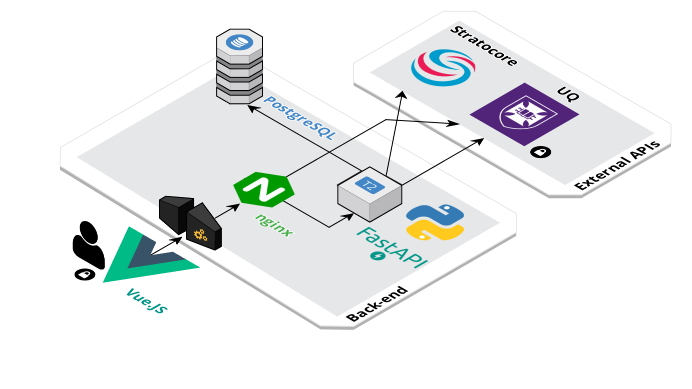
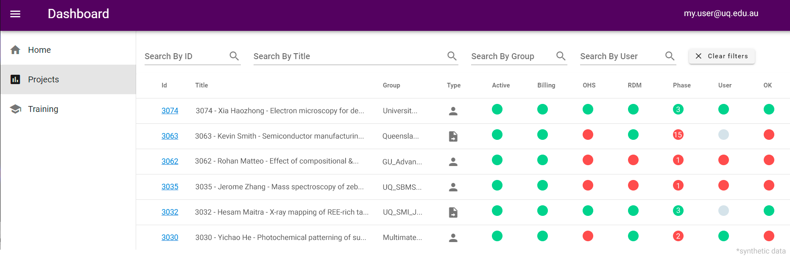

# Overview

This dashboard is a frontpage for UQ's Research Infrastructure Management System (RIMS), used to manage user and client projects within the University's research infrastructure labs, facilitating access to high-end instrumentation such as electron microscopes and mass-spectrometers. 

RIMS-dashboard is an internal tool providing up-to-date status information on users, projects, instruments and training requests to facility staff. It integrates data from university systems such as the 3rd-party SaaS management system, PPMS. 

The application is designed and developed by the Centre for Microscopy and Microanalysis (CMM) and the Research Computing Centre (RCC).

# Architecture

<p align="left">
  
  <br />
</p>

The app uses a Vue.JS frontend served via nginx, a PostgreSQL DB, and a Python/FastAPI backend  communicating with both the 3p SaaS Stratocore (RIMS) system, and a UQ RCC auth server. The app is designed to be deployed on AWS/Nectar via Docker and Kubernetes.

# Features

<p align="left">
  
  <br />
</p>

The application presents an at-a-glance summary of the status of a facility's projects in RIMS, using data populated via the Statocore API. Projects and users can be expanded to display further details, user lists, request forms etc. 

Related functionality is also provided for training requests, linking to the request details. 

User authentication is provided via keycloak and UQ's established 2FA system, and an extended control panel is displayed to facility superusers.


# Installation

The application is fully containerised, and can be easily stood up via docker-compose. 

```py
#clone
git clone git@github.com:UQ-RCC/rims-dashboard.git

cd rims-dashboard

#build
docker-compose -f docker-compose.prod.yml build

#start
docker-compose -f docker-compose.prod.yml up -d

#end
docker-compose -f docker-compose.prod.yml down -d

```

To correctly interface with the RIMS/PPMS system, the RIMS and keycloak config must be specified in backend/conf/rimsdash.conf. 

This must include a valid RIMS API key in "api2_key", and a valid keycloak server config and public key under the [keycloak] section. If needed, UQ facilities can contact UQ RCC to obtain these for their core.